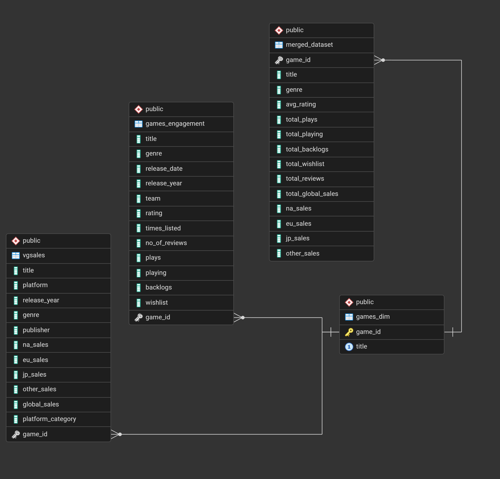

# 🎮 VideoGame_Sales_&amp;_Engagement_Analysis

## 📌 Project Overview

This project analyzes video game industry trends by integrating **user engagement data** with  **global and regional sales performance** . The objective is to identify the key drivers of commercial success by examining genre popularity, platform performance, engagement metrics (ratings, plays, wishlist), and regional market dynamics.

## 🏆 Project Highlights

- Analyzed 16,000+ video game sales records
- Built SQL queries for insight extraction
- Designed interactive Power BI dashboard with 8 KPIs

## 🎯 Business Objective

To analyze how genre trends, user engagement behavior, and regional sales performance collectively influence global video game success, and to identify actionable insights for strategic decision-making.

## 📂 Project Structure
```
VIDEO GAMES DA
│
├── Dashboard
│   ├── Screenshots
│   └── VGdashboard.pbix
│
├── Database
|   └── Database.png
|
├── Datasets
│   ├── games.csv
│   └── vgsales.csv   
│
├── Exploratory_Data_Analysis
│   └── EDA.ipynb
│
├── SQL_Insights
│   └── games.sql
│
└── README.md
```

## 🗄 Database Design

A relational schema was implemented using PostgreSQL.



### Tables :
- `games_engagement` – User engagement metrics (ratings, plays, wishlist, reviews, etc.)
- `vgsales` – Regional and global sales data
- `games_dim` – Dimension table with unique `game_id`
- `merged_dataset` – Aggregated analytical dataset combining engagement and sales

### Key Features
- Surrogate primary key (`game_id`)
- Foreign key constraints for referential integrity
- Indexed joins for performance optimization
- Aggregation using CTEs to prevent duplication bias
- Clean title standardization using LOWER(TRIM())

## 📊 Exploratory Data Analysis (Python)

The EDA phase focused on:

- Genre distribution and popularity
- Sales trends over time
- Regional performance comparison
- Wishlist vs Sales relationship (log-scale analysis)
- Rating vs Sales impact
- Engagement intensity by genre
- Genre–Platform performance heatmaps

## Visualizations included:

- Bar charts
- Line plots
- Scatter plots
- Heatmaps
- Log-scale correlation analysis

## 📈 Power BI Dashboards

Three interactive dashboards were developed:

### 🟢 Dashboard 1 – Sales Performance

- Global sales by genre
- Platform-wise sales
- Regional sales heatmap
- KPI indicators (Total Sales)

### 🟡 Dashboard 2 – User Engagement

- Rating distribution
- Top-rated games
- Wishlist vs Sales scatter
- Engagement metrics (Plays, Backlogs, Wishlist)

### The dashboards use DirectQuery connection to PostgreSQL.

## 🔍 Key Insights

- North America is the dominant revenue-driving region.
- Industry sales peaked during the 2008–2009 console generation.
- Action and RPG genres dominate production and revenue.
- MOBA and Shooter genres exhibit the highest engagement intensity.
- Wishlist shows a moderate positive correlation with global sales.
- The industry follows a blockbuster-driven revenue structure.
- Engagement and ratings do not always directly translate into higher sales.
- Regional genre preferences vary significantly (e.g., RPG dominance in Japan).

## 💼 Business Impact

The analysis provides actionable insights for:

- Genre investment strategy
- Regional marketing optimization
- Platform targeting decisions
- Demand forecasting using wishlist data
- Portfolio diversification strategies
- Monetization optimization for high-engagement genres

## 💡 Business Recommendations

- Publishers should prioritize Action and RPG genres in North America.
- Wishlist growth could be used as a pre-launch demand indicator.
- Marketing strategy should differ by region due to genre preference differences.

### By combining engagement metrics with sales performance, the project enables data-driven decision-making for publishers and stakeholders in the gaming industry.

## 💻 Tech Stack

- Python (Pandas, Matplotlib, Seaborn)
- PostgreSQL
- SQL (CTEs, Aggregations, Indexing, Foreign Keys)
- Power BI (DirectQuery, DAX Measures)
- VS Code 

## 📌 Conclusion

This project demonstrates how integrating behavioral engagement metrics with commercial sales data provides a holistic understanding of success drivers in the video game industry. The structured database design, rigorous EDA, and interactive dashboards collectively support strategic insights and scalable analytics.

